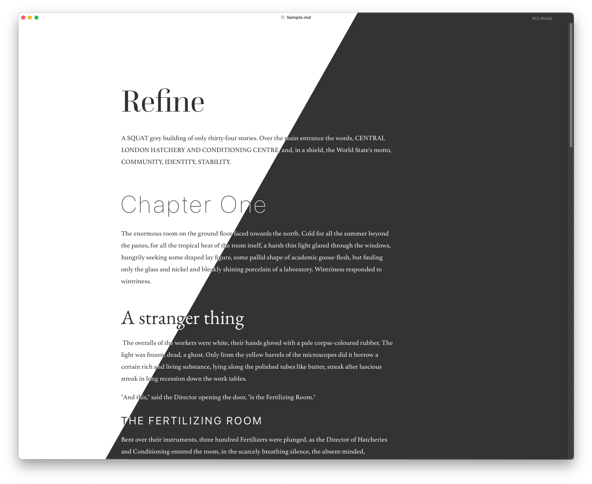

# À la Mode

This [Typora](https://typora.io) theme is forked from the [Refine theme](https://github.com/heisenburger/typora-theme-refine) -- with some distinct goals that differ from the original. That overall theme is delightful, but as a non-Adobe user, my experience of the original's intent is hampered, and I have other preferences for fonts.

## Font stack

The original theme's README says:

> A few people have asked me what fonts you need installed to render the fonts displayed in the sample screenshots. The typefaces that you see are:
>
> - [Questa and Questa Grande](https://fonts.adobe.com/foundries/the-questa-project)
> - [SF Pro](https://developer.apple.com/fonts/)
> - [Athelas](https://fonts.adobe.com/fonts/athelas)
> - [Garamond](https://fonts.google.com/specimen/EB+Garamond)
[source](https://github.com/heisenburger/typora-theme-refine#font-stack)

Instead, I'm interested in using a local resource folder, and fonts that are initially available from the web under accessible licenses.

### Headers

### Body
